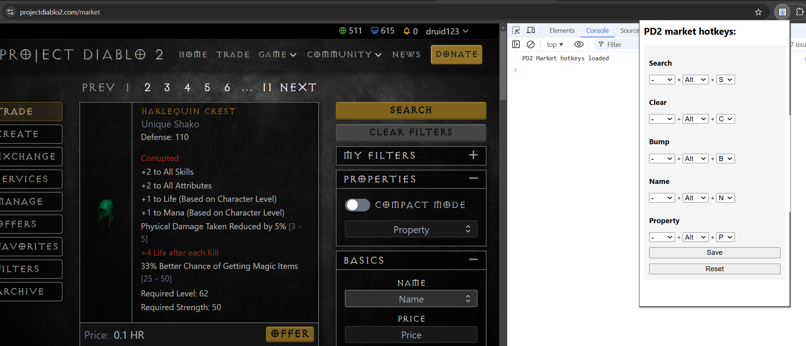

# Project Diablo 2 Market Hotkeys Extension

Enhance your Diablo 2 trading experience with our user-friendly Chrome Extension designed for seamless navigation on the PD2 Market page. With a range of customizable hotkeys at your fingertips, you can perform market actions swiftly and efficiently, all without lifting your hands from the keyboard.

## Features

- **Exclusive to PD2 Market Page:** This extension is tailor-made to work specifically on the Project Diablo 2 (PD2) Market page, ensuring a dedicated and focused tool for your trading needs.
- **Zero Dependencies:** Lightweight and efficient, our extension doesn't rely on any external libraries, ensuring that it's fast and straightforward to use.
- **Search Hotkey:** Search button press.
- **Clear Filters Hotkey:** Clear filters button press.
- **Bump All Hotkey:** Bump all items in manage list.
- **Name Hotkey:** Quickly jump to the "Name" input field and start typing your desired item name.
- **Property Hotkey:** Jump to the "Property" input field and start typing your desired item property.

## Installation

1. **Download the Extension:** Access the latest release directly from [GitHub Releases](https://github.com/alexuzh/pd2-market-hotkeys/releases).
2. **Extract the Folder:** Unzip the downloaded file to extract the extension folder.
3. **Load Unpacked Extension:** Follow Chrome's easy guide on [loading extensions](https://developer.chrome.com/docs/extensions/get-started/tutorial/hello-world#load-unpacked) to enable the extension on your browser.

## Usage

1. **Open the Market Page:** Navigate to the PD2 market.
2. **Activate Hotkeys:** Make use of the pre-set default hotkeys or customize them to your preference for personalized navigation.

## Known Issues

- **Hotkey Conflicts:** Currently, the extension allows assigning the same hotkey to multiple actions, which can cause unexpected behavior.

## TODO

- **Conflict Prevention:** Implement a feature to validate hotkey assignments, ensuring that a unique hotkey is designated for each action.